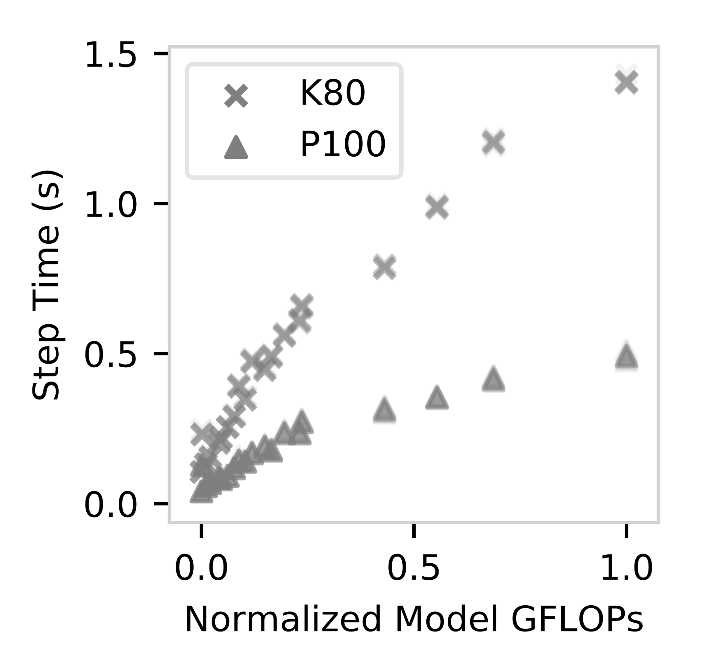
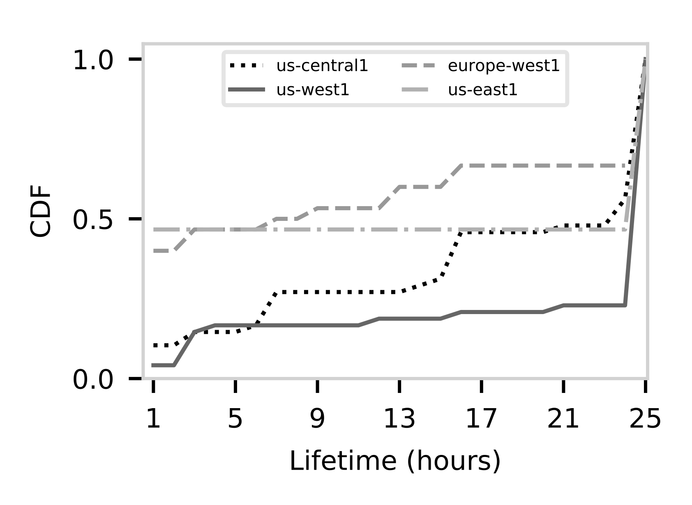
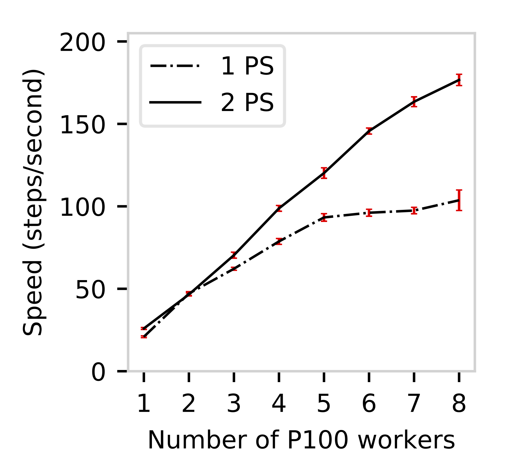

# CM-DARE: Characterizing and Modeling Distributed Training with Transient Cloud GPU Servers

## About

This repo contains code and data for the paper [**Characterizing and Modeling Distributed Training with Transient Cloud GPU Servers**]() in proceedings of ICDCS'20. 

In this paper, we tackle the problem of how to achieve cost saving and speeding up distributed training using cloud-based GPU servers, fully exploiting the transient option provided by the cloud vendors. Transient cloud servers are just as powerful as regular ones, but can be revoked at any time by the vendors. We streamline the distributed training deployment, training and measurement with the framework CM-DARE built on top of TensorFlow and Tensor2Tensor. Our empirical datasets collected using CM-DARE include measurements from three GPU types, six ge- ographic regions, twenty convolutional neural networks, and thousands of Google Cloud servers. In addition, we demonstrate the feasibility of predicting training speed and overhead using regression-based models. We also discuss potential use cases of our performance modeling such as detecting and mitigating performance bottlenecks.

#### Highlight

- Several performance models that predict distributed training on transient servers, e.g. the training speed and fault-tolerance overhead of GPU clusters, with as low as 3.4% mean absolute percentage error. We identified appropriate deployment scenarios for each performance model, including in a heterogeneous environment.

- Large scale transient server lifetime and revoke pattern study shows several important factors to more efficiently use transient servers on Google Compute Engine.

- Potential use cases to further demostrate the potential of our performance modeling, particularly shedding light on the bottleneck problem in training.

<div align="center"></div>

**Fig 1. Predicting training speed with particular GPU, using model complexity.**

<div align="center"></div>

**Fig 2. Lifetime CDF of transient K80 GPU servers in 4 different regions over 156 instances.**

<div align="center"></div>

**Fig 3. Use case: identifing bottleneck imposed by parameter servers.**

## How to use the code

#### Dependency and cloud image

The code used custom cloud images for both GPU and CPU servers, and the images are currently not public. Thus in order to run it, you need to create two custom images first.

We ran the code on cloud servers with Ubuntu 18.04 LTS, 4 vCPU cores and 24 GB memory for PS, 8 vCPU cores and 51 GB for workers, with 100 GB HD disk space. Ubuntu 16.04 LTS might work, but wil have unexpected behavior such as shutdown scripts not working properly.

First create a VM and `ssh` into it.

Then update apt-get and install the dependencies. 
```bash
sudo apt-get update
sudo apt-get install -y openjdk-8-jdk git python-dev python3-dev python-numpy python3-numpy build-essential python-pip python3-pip python-virtualenv swig python-wheel libcurl3-dev curl g++ freeglut3-dev libx11-dev libxmu-dev libxi-dev libglu1-mesa libglu1-mesa-dev parallel
```

Install nvidia drivers; the code is based on CUDA 9.0. Notice: all the CUDA and CUDNN related dependencies are not required for the CPU image.
```bash
### Install NVIDIA driver
sudo apt install nvidia-384 nvidia-384-dev
### CUDA 9.0 requires gcc 6.0
sudo apt install gcc-6
sudo apt install g++-6
### Get CUDA 9.0 files and install
wget https://developer.nvidia.com/compute/cuda/9.0/Prod/local_installers/cuda_9.0.176_384.81_linux-run
chmod +x cuda_9.0.176_384.81_linux.run
sudo ./cuda_9.0.176_384.81_linux.run --override
```

After rebooting the VM, check if CUDA is installed properly.
```bash
sudo reboot
nvidia-smi
```

An operational GPU would return something like:
```
+-----------------------------------------------------------------------------+
| NVIDIA-SMI 396.26                 Driver Version: 396.26                    |
|-------------------------------+----------------------+----------------------+
| GPU  Name        Persistence-M| Bus-Id        Disp.A | Volatile Uncorr. ECC |
| Fan  Temp  Perf  Pwr:Usage/Cap|         Memory-Usage | GPU-Util  Compute M. |
|===============================+======================+======================|
|   0  Tesla K80           Off  | 00000000:00:04.0 Off |                    0 |
| N/A   35C    P8    27W / 149W |     15MiB / 11441MiB |      0%      Default |
+-------------------------------+----------------------+----------------------+
                                                                               
+-----------------------------------------------------------------------------+
| Processes:                                                       GPU Memory |
|  GPU       PID   Type   Process name                             Usage      |
|=============================================================================|
|    0      1658      G   /usr/lib/xorg/Xorg                            14MiB |
+-----------------------------------------------------------------------------+
```

Install CUDNN 7.5; you need to go to the Nvidia website and register, then download the `tar` file and install it.


Edit cuda path to `~/.bashrc` and reload it.
```bash
echo 'export PATH=/usr/local/cuda-9.0/bin:$PATH' >> ~/.bashrc
echo 'export LD_LIBRARY_PATH=/usr/local/cuda-9.0/lib64:$LD_LIBRARY_PATH' >> ~/.bashrc
source ~/.bashrc
```

Don't forget to move CUDNN to the CUDA folder.
```
sudo cp -P cuda/include/cudnn.h /usr/local/cuda-9.0/include
sudo cp -P cuda/lib64/libcudnn* /usr/local/cuda-9.0/lib64/
sudo chmod a+r /usr/local/cuda-9.0/lib64/libcudnn*
```

The last step would be to install `TensorFlow 1.10` and modified `Tensor2Tensor`. `Tensor2Tensor` can be found in the `code` folder.
```bash
sudo pip install tensorflow-gpu==1.10
## for cpu servers install tensorflow==1.10 instead
pip install -e ~/code/tensor2tensor
sudo pip install mesh-tensorflow == 0.0.5
sudo pip install upgrade google-api-python-client
```

After the dependency installation, make two images, one for workers and one for parameter servers. Example command as below (to create the `instance-gpu` and `instance-cpu` images that we used in the code):
```bash
gcloud compute instances set-disk-auto-delete instance-gpu \
--disk instance-gpu --no-auto-delete

gcloud compute instances set-disk-auto-delete instance-cpu \
--disk instance-cpu --no-auto-delete

gcloud compute images create gpu-ubuntu18 \
--source-disk instance-gpu

gcloud compute images create cpu-ubuntu18 \
--source-disk instance-cpu
```

#### Running the code

The code supports training models implemented in the Tensor2Tensor library. For the paper we mainly used ResNet models. The code currently supports Google Compute Engine.

To run the code, simply input the following command. It will set up a cluster with 1 parameter server and 4 workers equipped with K80 GPU, and train the CIFAR-10 dataset on ResNet-32 for 64k steps. The trained model will be generated in the specified cloud bucket. 

```bash
python main.py --proj-name=YOUR_PROJ_NAME --cred-path=YOUR_GCE_CREDENTIAL_PATH --job-name=res32 --num-ps=1 --ps-core-num=4 --num-worker=4 --num-shard=1 --bucket-dir=gs://YOUR_BUCKET/ --model=resnet --hparam-set=resnet_cifar_32 --problem=image_cifar10 --train-steps=64000 --ckpt-frequency=100000 --automation-test=0 --setSlot=1 --maxWorker=8 --zone=us-west1-b --gpu=k80 --hetero=0
```

Explanations of the other parameters can be found below; they are experimental and not the core focus of the paper:

* ps-core-num: determines the number of vCPU cores for parameter servers. 

* num-shard: how many shards to partition the parameter set.

* ckpt-frequency: how frequent to checkpoint during training.

* automation-test: only used in combination with a monitor, currently not supported.

* setSlot: part of test for dynamic learning rate.

* maxWorker: part of test for dynamic learning rate.

Alternatively, if you want to test out heterogeneous cluster config, for example 4 workers and 1 parameter: parameter server in us-west1-b, 2 K80 GPU servers in us-west1-b, 1 P100 server in us-central1-a, and 1 V100 server in us-east1-a, you can use the following command:

```bash
python main.py --proj-name=YOUR_PROJ_NAME --cred-path=YOUR_GCE_CREDENTIAL_PATH --job-name=res32 --num-ps=1 --ps-core-num=4 --num-worker=4 --num-shard=1 --bucket-dir=gs://YOUR_BUCKET/ --model=resnet --hparam-set=resnet_cifar_32 --problem=image_cifar10 --train-steps=64000 --ckpt-frequency=100000 --automation-test=0 --setSlot=1 --maxWorker=8 --hetero=1 --gpu_array=k80 k80 p100 v100 --zone_array=us-west1-b us-west1-b us-west1-b us-central1-a us-east1-b
```

## Citation

To be published in proceedings of ICDCS'20.

## Acknowledgement

This work is supported in part by National Science Foundation grants #1755659 and #1815619, and Google Cloud Platform Research credits.

## Contact

More project information can be found in our lab's [project site](https://cake-lab.github.io/projects/). 

- Shijian Li [sli8@wpi.edu](sli8@wpi.edu)

- Robert Walls [rjwalls@wpi.edu](rjwalls@wpi.edu)

- Tian Guo [tian@wpi.edu](tian@wpi.edu)